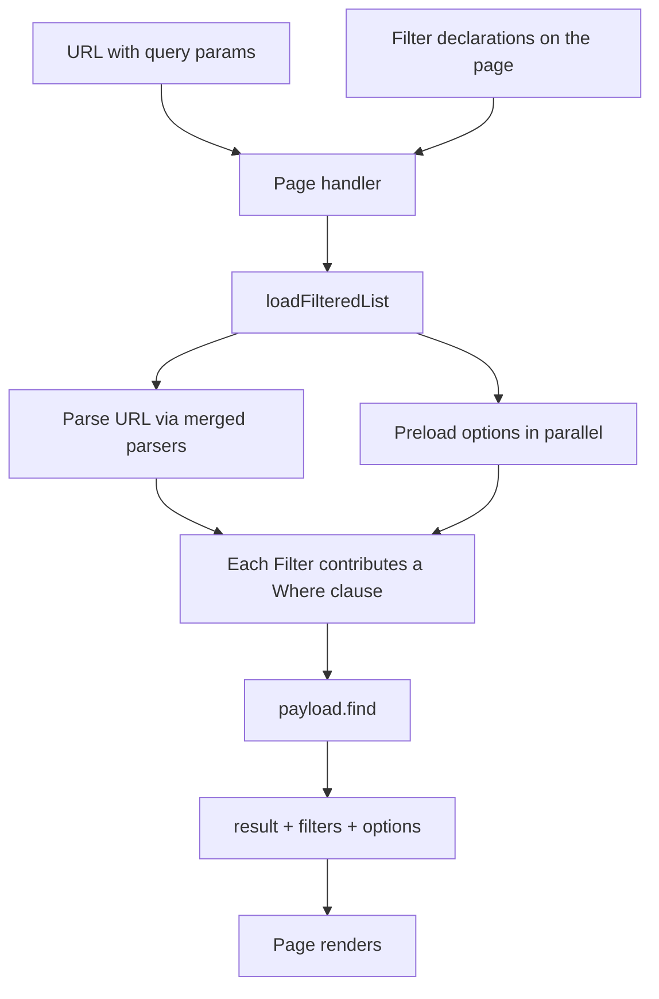

# List + Filter architecture

> Dansk version (dybdedyk med kode-uddrag): [filtered-list.da.md](./filtered-list.da.md)

A **List** is a page-level read pattern over a Payload collection where the result set is narrowed by URL-driven **Filters**. Today: the Events List (`/events`) and the Locations List (`/locations`).

A page declares which Filters it wants and calls `loadFilteredList`. Each Filter owns its URL parser, its preload (an option collection, the current user, …) and the `Where` clause it contributes. Adding a new filter axis is adding one Filter.

## Request flow

## Where things live

- `src/filteredList/` — the executor (`loadFilteredList`) and the filter factories (`pickOneFilter`, `pickManyFilter`, `dayFilter`, `toggleFilter`)
- `src/components/events/filters/eventsFilters.ts` — the Events List's filter declarations
- `src/components/locations/filters/locationsFilters.ts` — the Locations List's filter declarations
- `src/components/filters/sharedFilterParsers.ts` — parser primitives shared between server and client (incl. `pageParser`, `perPageParser`)
- `src/components/filters/CategoryChipRow.tsx`, `SlugComboboxFilter.tsx`, `PerPageSelect.tsx` — filter UI controls
- `src/components/FilteredListing/` — the shared page-level view that composes header / filter bar / grid / pagination / skeleton around the result (see [filtered-listing.da.md](./filtered-listing.da.md))

## Not handled by the filter system

Pagination (`page`) and per-page size (`perPage`) are URL state but not narrowing axes — they live outside `loadFilteredList`. Each page parses them with its own `createLoader({ page: pageParser, perPage: perPageParser })` and feeds the result into `query.limit` / `query.page`. See `src/app/(frontend)/events/page.tsx`.

## Adding a new Filter

1. If a new *kind* of filter (e.g. geo, range, text-search): add a factory in `src/filteredList/`.
2. Add one entry to `eventsFilters` (or `locationsFilters`) using that factory.
3. Optionally add a UI control in the page that reads/writes the URL param via nuqs.

That's it — no edits to `loadFilteredList`, no manual `Promise.all`, no separate where-builder.
