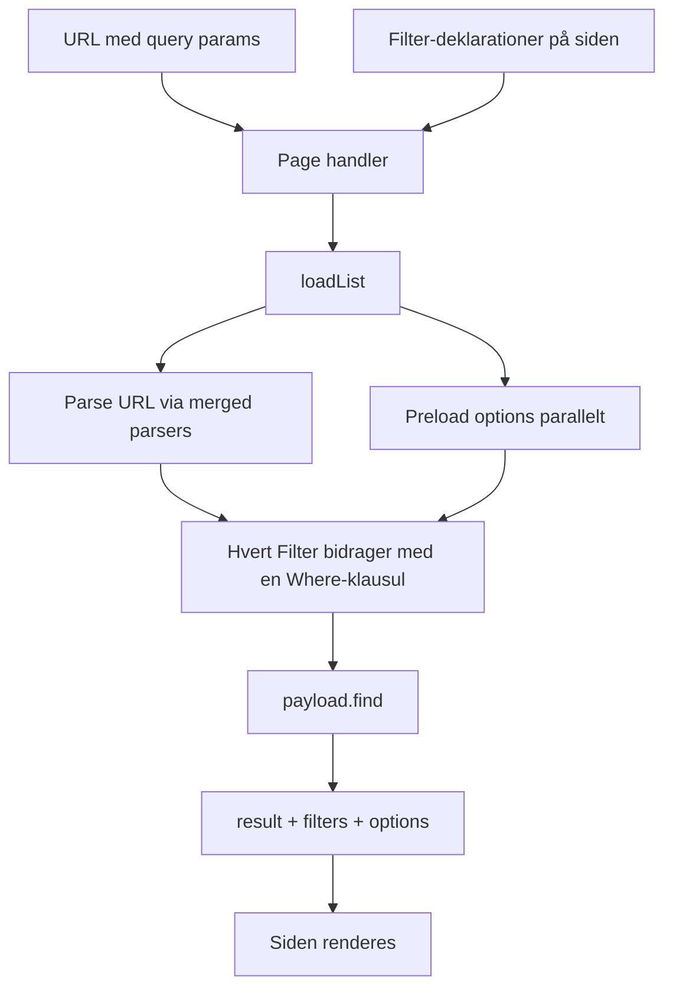

# List + Filter — arkitektur i dybden

> English version: [list-and-filters.md](./list-and-filters.md)

Dette dokument forklarer hvordan filter-systemet i `src/list/` virker, fra det øjeblik brugeren ændrer URL'en til Payload returnerer resultatet. Det er tænkt som en sammenhængende læseguide — start fra toppen.

---

## 1. Hvad er en "List"?

En **List** er en side der viser dokumenter fra en Payload-kollektion, hvor resultatet smalnes via URL-styrede **Filters**. I dag har vi to:

- **Events List** på `/events` — bruger [`eventsFilters`](../src/components/events/filters/eventsFilters.ts).
- **Locations List** på `/locations` — bruger [`locationsFilters`](../src/components/locations/filters/locationsFilters.ts).

URL'en er **single source of truth** for filter-tilstanden. Det betyder:

- Man kan bookmarke en filtreret visning.
- Tilbage-knappen i browseren virker som forventet.
- Server-komponenten (page handler) kan altid genberegne resultatet ud fra URL'en alene — ingen skjult state.

---

## 2. Det fulde request-flow



Det centrale punkt er `loadList`: den modtager URL'en og en filter-deklaration, og returnerer alt siden skal bruge for at rendere — både selve søgeresultatet, den parsede filter-tilstand (til at vise hvad der er valgt), og de preloadede options (til at rendere fx kategori-chips med titler).

---

## 3. `Filter`-typen — fire kontrakter

Hele systemet hænger på én lille type. Den findes i [`src/list/types.ts`](../src/list/types.ts):

```ts
export type Filter<TState = unknown, TOptions = unknown> = {
  parsers: Record<string, any>
  read: (loaded: Record<string, unknown>) => TState
  preload?: (payload: Payload) => Promise<TOptions>
  toWhere: (state: TState, options: TOptions) => Where | null
}
```

Et `Filter` er én "akse" man kan smalne listen på (kategori, region, dato …) og det bundter fire bekymringer:

| Felt        | Ansvar                                                                         |
| ----------- | ------------------------------------------------------------------------------ |
| `parsers`   | Hvilke URL-keys lytter dette filter på, og hvordan parses de? (nuqs-parsers)   |
| `read`      | Træk de parsede værdier ud af det merged loader-resultat og normalisér dem.    |
| `preload?`  | Hent option-data fra Payload (fx alle kategorier) — kun nødvendigt for nogle.  |
| `toWhere`   | Byg den Payload `Where`-klausul dette filter bidrager med (eller `null`).      |

Det er det. Hver konkret filter-fabrik returnerer et objekt der opfylder denne kontrakt.

---

## 4. De fire fabrikker

`src/list/` indeholder fire fabrikker — hver dækker et almindeligt filter-mønster. Tilføj kun en ny fabrik når et helt nyt mønster dukker op.

### 4.1 `pickOneFilter` — én slug → `equals`

Brugeren vælger ét element fra en option-kollektion (fx én region). URL'en bærer ét slug, filteret slår op i Payload for at finde det matchende id, og bygger en `equals`-klausul.

**[`src/list/pickOne.ts:15-49`](../src/list/pickOne.ts#L15-L49)**

```ts
export const pickOneFilter = <T extends SlugItem = SlugItem>(args: {
  paramKey: string
  collection: CollectionSlug
  payloadPath: string
  limit?: number
  sort?: string
  select?: Record<string, true>
}): Filter<string | null, T[]> => {
  const parser = parseAsString
    .withDefault('')
    .withOptions({ ...serverSyncOptions, clearOnDefault: true })

  return {
    parsers: { [args.paramKey]: parser },
    read: (loaded) => normalizeSlug((loaded[args.paramKey] as string | undefined) ?? ''),
    preload: async (payload) => {
      const res = await payload.find({
        collection: args.collection,
        depth: 0,
        limit: args.limit ?? 200,
        overrideAccess: false,
        sort: args.sort,
        select: args.select,
      })
      return res.docs as unknown as T[]
    },
    toWhere: (slug, options) => {
      if (!slug) return null
      const id = resolveIdBySlug(slug, options)
      if (id === null) return null
      return { [args.payloadPath]: { equals: id } }
    },
  }
}
```

| URL                  | `read` → state | `toWhere` → Where                          |
| -------------------- | -------------- | ------------------------------------------ |
| `?region=`           | `null`         | `null` (intet bidrag)                      |
| `?region=cph`        | `"cph"`        | `{ "location.address.region": { equals: 2 } }` (efter slug→id) |
| `?region=ukendt`     | `"ukendt"`     | `null` (slug findes ikke i preloadede options) |

### 4.2 `pickManyFilter` — array af slugs → `in`

Som `pickOneFilter`, men URL'en bærer flere slugs adskilt af komma (håndteres af `parseAsArrayOf(parseAsString)`). Bygger en `in`-klausul.

**[`src/list/pickMany.ts:14-46`](../src/list/pickMany.ts#L14-L46)**

```ts
export const pickManyFilter = <T extends SlugItem = SlugItem>(args: {
  paramKey: string
  collection: CollectionSlug
  payloadPath: string
  limit?: number
  sort?: string
  select?: Record<string, true>
}): Filter<string[], T[]> => {
  return {
    parsers: { [args.paramKey]: categoriesParser },
    read: (loaded) => {
      const raw = (loaded[args.paramKey] as string[] | undefined) ?? []
      return normalizeCategorySlugs(raw)
    },
    preload: async (payload) => { /* henter option-kollektionen */ },
    toWhere: (slugs, options) => {
      if (slugs.length === 0) return null
      const ids = resolveIdsBySlug(slugs, options)
      if (ids.length === 0) return null
      return { [args.payloadPath]: { in: ids } }
    },
  }
}
```

| URL                              | state                | Where                                       |
| -------------------------------- | -------------------- | ------------------------------------------- |
| `?categories=`                   | `[]`                 | `null`                                      |
| `?categories=music,art`          | `["music", "art"]`   | `{ categories: { in: [3, 7] } }`            |

### 4.3 `toggleFilter` — string-literal → boolean `equals`

Et toggle mellem to faste URL-værdier. Bidrager **altid** med en `Where`-klausul (også på default) — URL'en rydder bare query-param'et når man er på defaulten.

**[`src/list/toggle.ts:20-38`](../src/list/toggle.ts#L20-L38)**

```ts
export const toggleFilter = <V extends string>(args: {
  paramKey: string
  values: readonly V[]
  defaultValue: V
  payloadPath: string
  trueWhen: V
}): Filter<V, undefined> => {
  const parser = parseAsStringLiteral(args.values)
    .withDefault(args.defaultValue)
    .withOptions({ ...serverSyncOptions, clearOnDefault: true })

  return {
    parsers: { [args.paramKey]: parser },
    read: (loaded) => (loaded[args.paramKey] as V | undefined) ?? args.defaultValue,
    toWhere: (value): Where => ({
      [args.payloadPath]: { equals: value === args.trueWhen },
    }),
  }
}
```

Eksempel — Events' `source`-toggle: `syt` (See You There) eller `community`. Payload-feltet hedder `createdBySeeYouThere` (boolean):

| URL                  | state         | Where                                       |
| -------------------- | ------------- | ------------------------------------------- |
| (intet — default)    | `"syt"`       | `{ createdBySeeYouThere: { equals: true } }` |
| `?source=community`  | `"community"` | `{ createdBySeeYouThere: { equals: false } }` |

### 4.4 `dayFilter` — YYYY-MM-DD → halv-åbent dag-vindue

Et enkelt dato-felt. Validerer formatet med regex; bygger en halv-åben klausul `[dagens-start, næste-dags-start)`.

**[`src/list/day.ts:14-38`](../src/list/day.ts#L14-L38)**

```ts
export const dayFilter = (args: {
  paramKey: string
  payloadPath: string
}): Filter<string | null, undefined> => {
  const parser = parseAsString
    .withDefault('')
    .withOptions({ ...serverSyncOptions, clearOnDefault: true })

  return {
    parsers: { [args.paramKey]: parser },
    read: (loaded) => {
      const raw = (loaded[args.paramKey] as string | undefined) ?? ''
      return raw && ISO_DATE.test(raw) ? raw : null
    },
    toWhere: (day) => {
      if (!day) return null
      return {
        [args.payloadPath]: {
          greater_than_equal: `${day}T00:00:00.000Z`,
          less_than: `${nextIsoDay(day)}T00:00:00.000Z`,
        },
      }
    },
  }
}
```

| URL                    | state          | Where                                                            |
| ---------------------- | -------------- | ---------------------------------------------------------------- |
| `?date=`               | `null`         | `null`                                                           |
| `?date=2026-05-28`     | `"2026-05-28"` | `{ startDate: { greater_than_equal: …T00:00Z, less_than: …T00:00Z } }` |
| `?date=ulovligt`       | `null`         | `null` (regex afviser inputtet)                                  |

---

## 5. `loadList` — orkestratoren trin for trin

`loadList` er den eneste server-funktion siden behøver kalde. Den limer alle fabrikker sammen.

**[`src/list/loadList.ts:26-79`](../src/list/loadList.ts#L26-L79)**

### Trin 1 — saml alle parsers

```ts
const load = createLoader(mergeFilterParsers(filters))
```

`mergeFilterParsers` er en simpel reduce der spreder alle filtres `parsers`-maps ind i ét stort map. Det er den eneste grund den eksisterer ([`src/list/types.ts:27-31`](../src/list/types.ts#L27-L31)):

```ts
export const mergeFilterParsers = (filters: FiltersRecord): Record<string, any> =>
  Object.values(filters).reduce<Record<string, any>>(
    (acc, f) => Object.assign(acc, f.parsers),
    {},
  )
```

Det merged map sendes til nuqs' `createLoader` — det giver os én funktion der kan parse hele URL'en i ét hug.

### Trin 2 — parse + preload parallelt

```ts
const [loaded, optionValues] = await Promise.all([
  load(searchParams),
  Promise.all(
    entries.map(([, f]) => (f.preload ? f.preload(payload) : Promise.resolve(undefined))),
  ),
])
```

URL-parsing og option-preloads er uafhængige, så de kører parallelt. Filtre uden `preload` får `undefined` som "options" — det er fint fordi `toggleFilter` og `dayFilter` ikke bruger options.

### Trin 3 — kald `read` og `toWhere` for hvert filter

```ts
entries.forEach(([name, f], i) => {
  const value = f.read(loaded)
  const opts = optionValues[i]
  ;(parsed as Record<string, unknown>)[name] = value
  ;(options as Record<string, unknown>)[name] = opts
  const contribution = f.toWhere(value, opts)
  if (contribution) whereClauses.push(contribution)
})
```

Her er det vigtigt at se: `parsed` og `options` indekseres på **filterets navn** (`source`, `date`, `categories` …) — ikke på URL-key'en. Det er derfor man på siden kan skrive `filters.categories` selvom URL'en hedder `?categories=…`.

### Trin 4 — kombinér Where-klausulerne

```ts
const where: Where | undefined =
  whereClauses.length === 0
    ? undefined
    : whereClauses.length === 1
      ? whereClauses[0]
      : { and: whereClauses }
```

Ingen klausuler → `undefined` (ingen filtrering). Én → brug den direkte. Flere → `{ and: [...] }`.

### Trin 5 — `payload.find` og returnér

```ts
const result = (await payload.find({
  ...query,
  overrideAccess: false,
  where,
})) as PaginatedDocs<T>

return { result, filters: parsed, options }
```

`overrideAccess: false` er vigtigt — det betyder Payload-access-control-reglerne gælder også her. Siden får tre ting tilbage:

- `result` — selve det paginerede søgeresultat.
- `filters` — den parsede filter-tilstand (til at vise hvad der er valgt).
- `options` — de preloadede option-kollektioner (til at vise titler i chips, dropdowns …).

---

## 6. Et rigtigt eksempel: `eventsFilters`

Events-siden samler fem filtre i ét objekt. Det er den fil man oftest redigerer i:

**[`src/components/events/filters/eventsFilters.ts:12-45`](../src/components/events/filters/eventsFilters.ts#L12-L45)**

```ts
export const eventsFilters = {
  source: toggleFilter({
    paramKey: 'source',
    values: EVENT_SOURCES,
    defaultValue: 'syt',
    payloadPath: 'createdBySeeYouThere',
    trueWhen: 'syt',
  }),
  date: dayFilter({
    paramKey: 'date',
    payloadPath: 'startDate',
  }),
  categories: pickManyFilter<Category>({
    paramKey: 'categories',
    collection: 'categories',
    payloadPath: 'categories',
    limit: 100,
  }),
  region: pickOneFilter<Region>({
    paramKey: 'region',
    collection: 'regions',
    payloadPath: 'location.address.region',
    limit: 200,
    sort: 'title',
  }),
  location: pickOneFilter<Location>({
    paramKey: 'location',
    collection: 'locations',
    payloadPath: 'location',
    limit: 500,
    sort: 'title',
    select: { title: true, slug: true },
  }),
}
```

For en URL som:

```
/events?source=community&categories=music,art&region=cph&page=2
```

bliver `filters` til:

```ts
{
  source: "community",
  date: null,
  categories: ["music", "art"],
  region: "cph",
  location: null,
}
```

og `options` indeholder de preloadede kollektioner for `categories`, `region` og `location` (toggle og day har `undefined` her).

`Where`-klausulen der ender hos `payload.find` bliver noget i retning af:

```ts
{
  and: [
    { createdBySeeYouThere: { equals: false } },                    // source
    { categories: { in: [3, 7] } },                                 // categories
    { "location.address.region": { equals: 12 } },                  // region
  ]
}
```

Bemærk: `date` og `location` bidrager ikke fordi deres værdi er `null` / tom.

Filen eksporterer også et **merged parser-map** til klient-komponenter ([`eventsFilters.ts:50-53`](../src/components/events/filters/eventsFilters.ts#L50-L53)):

```ts
export const eventsUrlParsers = {
  ...mergeFilterParsers(eventsFilters),
  page: pageParser,
}
```

Den genbruges af UI-kontrollerne så server og klient deler nøjagtig samme URL-parsing-regler.

---

## 7. Hvordan siden bruger det

**[`src/app/(frontend)/events/page.tsx:27-55`](../src/app/(frontend)/events/page.tsx#L27-L55)**

```tsx
export default async function EventsPage({
  searchParams,
}: {
  searchParams: Promise<Record<string, string | string[] | undefined>>
}) {
  const resolved = await searchParams
  const { page: rawPage } = loadPage(resolved)
  const page = Math.max(1, rawPage)

  const payload = await getPayload({ config: configPromise })

  const [me, list] = await Promise.all([
    getOptionalMe(),
    loadList<typeof eventsFilters, 'events', Event>({
      payload,
      searchParams: Promise.resolve(resolved),
      filters: eventsFilters,
      query: {
        collection: 'events',
        depth: 2,
        limit: PAGE_SIZE,
        page,
        sort: 'startDate',
      },
    }),
  ])
```

To detaljer der ofte forvirrer:

1. **`await searchParams` derefter `Promise.resolve(resolved)`** — Next.js 16 leverer `searchParams` som en Promise. Vi await'er den én gang (så vi kan parse `page` lokalt), men `loadList` vil **også** have en Promise (det er dens kontrakt med nuqs), så vi pakker den ind igen. Det er ikke et ekstra round-trip — bare en gen-pakning.
2. **`page` er ikke et Filter** — pagination er URL-state men ikke et narrowing-aksis. Det parses separat ([`docs/list-and-filters.da.md#7`](#)) og sendes ind i `query.page`.

Resultatet bruges som:

```tsx
const { result, filters, options } = list
// result.docs        — events at rendere
// filters.region     — det valgte region-slug (eller null)
// options.categories — alle preloadede kategori-docs
```

---

## 8. URL → klient-UI og tilbage igen

Indtil nu har vi kun talt om server-siden. Men hvordan kommer URL'en til at ændre sig når brugeren klikker på en chip?

Svaret er at klient-komponenterne bruger **samme nuqs-parsers** via `useQueryState` / `useQueryStates`. Når de skriver til URL'en, opdateres adresse-linjen, Next.js gen-renderer server-komponenten, og `loadList` kører igen med den nye URL.

Nøglen til at server-refresh sker er `shallow: false` — defineret én gang i:

**[`src/components/filters/sharedFilterParsers.ts:3-5`](../src/components/filters/sharedFilterParsers.ts#L3-L5)**

```ts
// shallow:false triggers a Next.js router refresh on each write so the
// server component re-runs the Payload query with the new filters.
export const serverSyncOptions = { shallow: false } as const
```

Alle filter-fabrikker spreder denne option ind i deres parsers. Det er det der gør at en chip-klik på klienten reelt får serveren til at køre en ny Payload-query.

De fire UI-komponenter:

| Komponent                                                                                              | Hook              | Hvad den styrer               |
| ------------------------------------------------------------------------------------------------------ | ----------------- | ----------------------------- |
| [`CategoryChipRow.tsx`](../src/components/filters/CategoryChipRow.tsx)                                 | `useQueryState`   | `categories` (multi-select)   |
| [`SlugComboboxFilter.tsx`](../src/components/filters/SlugComboboxFilter.tsx)                           | `useQueryState`   | `region` / `location` (single) |
| [`DateChipRail.tsx`](../src/components/events/filters/DateChipRail.tsx)                                | `useQueryStates`  | `date` + nulstil `page`       |
| [`SourceToggle.tsx`](../src/components/events/SourceToggle.tsx)                                        | `useQueryStates`  | `source` + nulstil `page`     |

De to komponenter der bruger `useQueryStates` skriver **flere keys samtidigt** — de nulstiller `page` til 1 sammen med deres egen ændring, så man ikke ender på "side 5" af en ny filtrering med kun 2 sider.

---

## 9. Slug → id-oversættelsen

URL'en bærer slugs (`?region=cph`) fordi de er læsbare og stabile — id'er kan ændre sig hvis databasen seedes om, og `?region=12` siger ingen noget. Men Payload's relations-queries har brug for det interne id.

Oversættelsen sker via to små hjælpere i:

**[`src/components/filters/sharedFilterParsers.ts:28-36`](../src/components/filters/sharedFilterParsers.ts#L28-L36)**

```ts
export const resolveIdsBySlug = <T extends SlugItem>(slugs: string[], items: T[]): T['id'][] => {
  const set = new Set(slugs)
  return items.filter((i) => i.slug && set.has(i.slug)).map((i) => i.id)
}

export const resolveIdBySlug = <T extends SlugItem>(
  slug: string | null,
  items: T[],
): T['id'] | null => (slug ? resolveIdsBySlug([slug], items)[0] ?? null : null)
```

`pickOneFilter` og `pickManyFilter` kalder disse i deres `toWhere`. Det er grunden til de overhovedet har en `preload`: hvis vi ikke har hele option-kollektionen i hånden, kan vi ikke oversætte slug → id.

---

## 10. Tilføj et nyt filter — opskrift

1. **Findes der allerede en fabrik der passer?** Hvis ja, hop til trin 2. Hvis det er et helt nyt mønster (fx pris-range, fritekst-søgning, geo), lav en ny fabrik i `src/list/` der opfylder `Filter`-kontrakten.

2. **Tilføj filteret til den relevante liste**, fx [`eventsFilters.ts`](../src/components/events/filters/eventsFilters.ts):

   ```ts
   export const eventsFilters = {
     // …
     price: pickOneFilter({
       paramKey: 'price',
       collection: 'price-bands',
       payloadPath: 'priceBand',
     }),
   }
   ```

3. **Tilføj en UI-kontrol** i page-træet der læser/skriver URL-param'et via nuqs. Brug en eksisterende komponent ([`SlugComboboxFilter`](../src/components/filters/SlugComboboxFilter.tsx) for single, [`CategoryChipRow`](../src/components/filters/CategoryChipRow.tsx) for multi) eller skriv en ny der følger samme mønster.

Det er det. Ingen ændringer til `loadList`, ingen manuel `Promise.all`, ingen separat where-builder.

---

## 11. Test og verifikation

Modulet har integration-tests der kører uden DB (de stubber `payload.find` med `vi.fn`):

**[`tests/int/list.int.spec.ts`](../tests/int/list.int.spec.ts)**

Kør dem:

```bash
npx vitest run --config ./vitest.config.mts tests/int/list.int.spec.ts
```

Testene er ordnet som en læseguide selv:
1. `mergeFilterParsers` — den simpleste enhed.
2. `pickOneFilter` — én fabrik fra ende til anden.
3. `loadList` — orkestratoren med stubbet `payload.find` og hand-rolled filtre.

Sæt en `console.log(loaded)` ind i en af test-filterets `read`-funktioner og kør igen for at se præcis hvad nuqs giver dig efter URL-parsing — det er den hurtigste måde at få en mavefornemmelse for hvad der sker.
