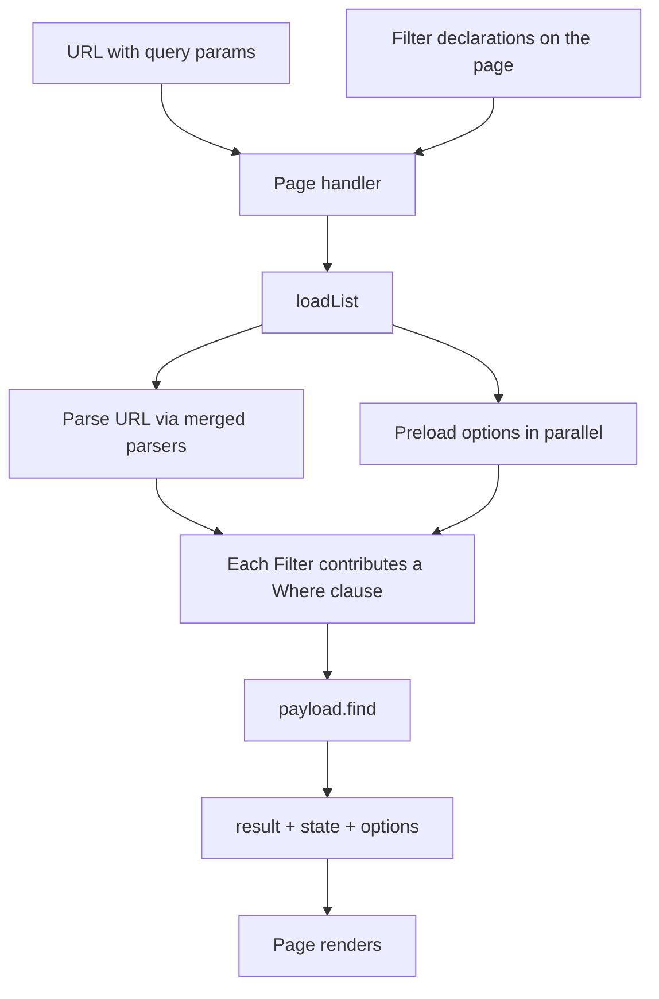

# List + Filter architecture

> Dansk version (dybdedyk med kode-uddrag): [list-and-filters.da.md](./list-and-filters.da.md)

A **List** is a page-level read pattern over a Payload collection where the result set is narrowed by URL-driven **Filters**. Today: the Events List (`/events`) and the Locations List (`/locations`).

A page declares which Filters it wants and calls `loadList`. Each Filter owns its URL parser, its preload (an option collection, the current user, …) and the `Where` clause it contributes. Adding a new filter axis is adding one Filter.

## Request flow

## Where things live

- `src/list/` — the executor (`loadList`) and the filter factories (`pickOneFilter`, `pickManyFilter`, `dayFilter`, `toggleFilter`)
- `src/components/events/filters/eventsFilters.ts` — the Events List's filter declarations
- `src/components/locations/filters/locationsFilters.ts` — the Locations List's filter declarations
- `src/components/filters/sharedFilterParsers.ts` — small parser primitives shared between server and client
- `src/components/filters/CategoryChipRow.tsx`, `SlugComboboxFilter.tsx` — the filter UI controls (hand-written per page)

## Adding a new Filter

1. If a new *kind* of filter (e.g. geo, range, text-search): add a factory in `src/list/`.
2. Add one entry to `eventsFilters` (or `locationsFilters`) using that factory.
3. Optionally add a UI control in the page that reads/writes the URL param via nuqs.

That's it — no edits to `loadList`, no manual `Promise.all`, no separate where-builder.
