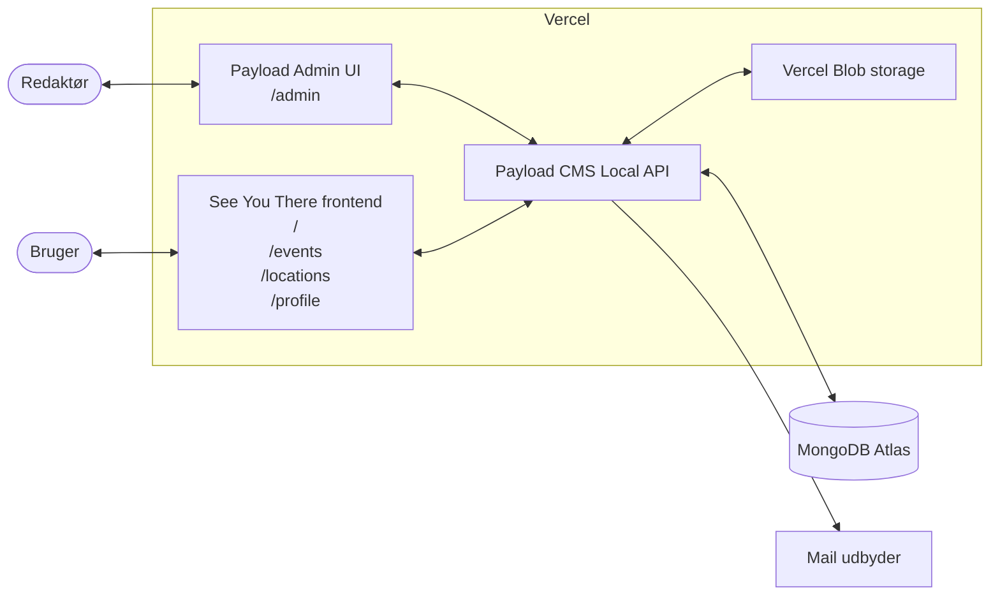
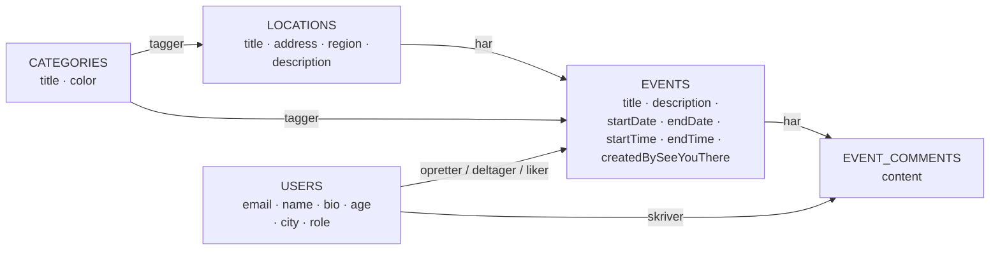

# Arkitektur

## Nuværende stack

### Payload
Payload udgør kernen af projektet. Det er et Node-baseret headless CMS (Content Management System), der fungerer særdeles godt sammen med Next.js. Jeg ser det som en fordel, at både frontend og backend er skrevet i JavaScript/TypeScript, så jeg ikke skal skifte mellem to forskellige sprog under udviklingen.

Payload er open source med et stort community og fremstår som et etableret projekt, der passer godt til denne løsning. Payload blev desuden opkøbt af Figma i 2025, hvilket både viser stor interesse for produktet og sikrer økonomi til, at projektet kan videreudvikles. Den version af Payload, jeg bruger, er v3, som blev udgivet i november 2024 og fortsat vedligeholdes aktivt.

**Fordele**
- Samme sprog i frontend og backend (TypeScript)
- Hurtigt at lære og let at tilpasse til projektets egne datamodeller
- Hosting er enklere, da der ikke skal driftes en separat PHP-server, som man fx ville skulle med WordPress
- Understøtter flere databaser, men jeg valgte MongoDB, som Payload anbefaler

### Next.js
En stor grund til, at jeg valgte Payload, er, at det som standard kommer med Next.js — en løsning jeg kender i forvejen. Next.js er et komplet React-framework, der dækker både server- og client-side, og som gør det hurtigt at bygge en solid frontend. Jeg bruger Next.js 16 (udgivet oktober 2025) med fil-baseret routing via App Router, hvilket gør det nemt at oprette nye sider sammenlignet med en "klassisk" client-side React-opsætning.

**Fordele**
- Samme sprog som backend (TypeScript)
- Fil-baseret routing via App Router gør sidestrukturen forudsigelig
- React Server Components giver mulighed for at hente data direkte på serveren uden ekstra API-lag
- Indbygget optimering af billeder, fonte og bundling
- Tæt integration med Vercel, som er den anbefalede hostingplatform

### MongoDB / Atlas
Payload anbefaler MongoDB, som er en dokument-baseret database. I modsætning til en relationel database (SQL), hvor data gemmes i tabeller med faste kolonner og relationer via fremmednøgler, gemmer MongoDB data som JSON-lignende dokumenter med et fleksibelt skema.

Det fleksible skema passer godt til et CMS-drevet projekt, fordi datamodellen ofte ændrer sig undervejs — felter tilføjes, omdøbes eller fjernes uden, at man behøver at køre tunge migrations. Til gengæld giver man afkald på nogle af de garantier, SQL-databaser tilbyder, fx joins på tværs af tabeller og transaktioner på tværs af flere collections. Payload håndterer relationer mellem dokumenter i applikationslaget, så dette er sjældent et problem i praksis.

MongoDB Atlas er en managed hosting-løsning til MongoDB, der tilbyder et gratis cluster, som passer til en prototype i denne størrelse.

### Diagram over teknisk arkitektur

Frontend og Payload CMS kører i samme Next.js-applikation på Vercel, så hele systemet deployes som én enhed med ét repo og ét sæt miljøvariabler. Payload genererer automatisk TypeScript-typer ud fra mine collections, som frontend-koden kan importere direkte — det betyder, at hvis jeg fx omdøber et felt på `events`-collectionen, fanger TypeScript med det samme de steder i frontenden, der refererer til det gamle navn. Data persisteres i MongoDB Atlas, og transaktionel mail sendes via en ekstern SMTP-udbyder.

Systemet har to UI-flader: den offentlige frontend, som almindelige brugere møder i browseren, og Payloads Admin UI på `/admin`, hvor redaktører opretter og redigerer indhold. Begge er en del af samme Next.js-applikation, men de fungerer som adskilte interfaces oven på den samme Payload-instans.

Uploads af billeder fra admin-UI'et går gennem Payload, som videresender filen til Vercel Blob via `@payloadcms/storage-vercel-blob`. Når et billede senere skal vises på sitet, returnerer Payload bare URL'en til Blob-filen — selve billed-bytes går ikke gennem Payload.

### Datamodel — events knyttet til steder

Kernen i datamodellen er, at en **Event** altid hører til ét **Location** (relationen er `required`), og at et Location omvendt eksponerer sine events via et `join`-felt. Både Locations og Events kategoriseres via en mange-til-mange relation til **Categories**, og hver Location har et adressefelt (gade, postnummer, by og region — vist samlet som `address` i diagrammet), så indhold kan filtreres geografisk.

**Users** indgår i flere roller på et event: som `opretter` (én pr. event), som `deltager` og som `liker` — de tre relationer er i diagrammet slået sammen til én pil for at holde det læseligt, men i koden er det tre selvstændige felter på `events`-collectionen. **EventComments** holder kommentartråden adskilt fra event-dokumentet, så listen kan vokse uden at oppuste selve eventet.

Diagrammet udelader **Media**-collectionen (som leverer billed-uploads til Locations, Events og Users) samt Payloads CMS-kollektioner (`Posts`, `Pages`, `Header`/`Footer`-globals), som ikke er en del af event-domænet.

## Hvad valgte jeg fra
- **WordPress**: Selvom vi blev introduceret til WordPress i skolen, virkede det ikke som den rigtige løsning her. Meget af konfigurationen lever inde i WordPress-admin'en — temaer, plugins, custom fields — og er dermed ikke synlig i kodebasen eller i Git-historikken. Payload er en *developer first*-platform hvor collections, hooks og adgangsregler defineres i TypeScript-filer der bor i repo'et. Det gør et projekt langt lettere at overskue, at code-review, og at rulle tilbage hvis noget går galt, fordi alle ændringer ligger som commits.
- **Andre headless CMS'er som Sanity og Strapi**: Sanity har et stærkt redaktørmiljø, men frontend og backend er adskilt på en måde, der ville have krævet mere opsætning. Strapi minder om Payload, men jeg fandt Payloads udvikleroplevelse og TypeScript-integration mere overbevisende.
- **Custom backend i Express + separat React-frontend**: Ville give fuld fleksibilitet, men også markant mere boilerplate (auth, admin-UI, validering m.m.). På et projekt af denne størrelse er det ikke en god prioritering.
- **Native app eller React Native**: Fravalgt for at fokusere på én kodebase. Hvis behovet opstår, kan en PWA dække mange af de samme behov uden at skulle vedligeholde to platforme.

## Hvad skulle måske have været anderledes
- **PostgreSQL i stedet for MongoDB**: Hvis datamodellen viser sig at have mange tværgående relationer (fx events ↔ steder ↔ brugere ↔ kommentarer), kunne en relationel database have gjort visse forespørgsler enklere. Payload understøtter PostgreSQL, så det er et muligt skifte senere.
- **PWA fra starten**: Offline-funktionalitet kunne med fordel være tænkt ind tidligere, så service workers og caching-strategier kunne bygges som en del af arkitekturen frem for som en senere tilføjelse.
