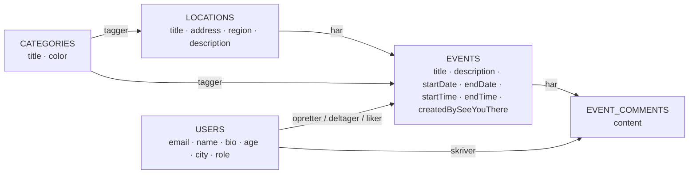

# Arkitektur

## Stack

### Payload
Payload udgør kernen af projektet. Det er et Node-baseret headless CMS (Content Management System), der fungerer særdeles godt sammen med Next.js. Jeg ser det som en fordel, at både frontend og backend er skrevet i JavaScript/TypeScript, så jeg ikke skal skifte mellem to forskellige sprog under udviklingen.

Payload er open source med et stort community og fremstår som et etableret projekt, der passer godt til denne løsning. Payload blev desuden opkøbt af Figma i 2025, hvilket både viser stor interesse for produktet og sikrer økonomi til, at projektet kan videreudvikles. Den version af Payload, jeg bruger, er v3, som blev udgivet i november 2024 og fortsat vedligeholdes aktivt.

**Fordele**
- Samme sprog i frontend og backend (TypeScript)
- Hurtigt at lære og let at tilpasse til projektets egne datamodeller
- Hosting er enklere, da der ikke skal driftes en separat PHP-server, som man fx ville skulle med WordPress
- Understøtter flere databaser, men jeg valgte MongoDB, som Payload anbefaler

### Next.js
En stor grund til, at jeg valgte Payload, er, at det som standard kommer med Next.js — en løsning jeg kender i forvejen. Next.js er et komplet React-framework, der dækker både server- og client-side, og som gør det hurtigt at bygge en solid frontend. Jeg bruger Next.js 16 (udgivet oktober 2025) med fil-baseret routing via App Router, hvilket gør det nemt at oprette nye sider sammenlignet med en "klassisk" client-side React-opsætning.

**Fordele**
- Samme sprog som backend (TypeScript)
- Fil-baseret routing via App Router gør sidestrukturen forudsigelig
- React Server Components giver mulighed for at hente data direkte på serveren uden ekstra API-lag
- Indbygget optimering af billeder, fonte og bundling
- Tæt integration med Vercel, som er den anbefalede hostingplatform

### MongoDB / Atlas
Payload anbefaler MongoDB, som er en dokument-baseret database. I modsætning til en relationel database (SQL), hvor data gemmes i tabeller med faste kolonner og relationer via fremmednøgler, gemmer MongoDB data som JSON-lignende dokumenter med et fleksibelt skema.

Det fleksible skema passer godt til et CMS-drevet projekt, fordi datamodellen ofte ændrer sig undervejs — felter tilføjes, omdøbes eller fjernes uden, at man behøver at køre tunge migrations. Til gengæld giver man afkald på nogle af de garantier, SQL-databaser tilbyder, fx joins på tværs af tabeller og transaktioner på tværs af flere collections. Payload håndterer relationer mellem dokumenter i applikationslaget, så dette er sjældent et problem i praksis.

MongoDB Atlas er en managed hosting-løsning til MongoDB, der tilbyder et gratis cluster, som passer til en prototype i denne størrelse.

## Authentication
Til brugeroprettelse og login bruger jeg Payloads indbyggede `users`-collection, som leverer hashing af passwords, sessions og rolle-baseret adgangskontrol ud af kassen. Det er en bevidst beslutning om at læne sig op ad et veletableret framework's defaults frem for at finde på noget selv på et sikkerhedsfølsomt område, hvor egne fejl kan have store konsekvenser.

### Clerk som muligt alternativ
Jeg har ikke selv arbejdet med Clerk endnu, men har set flere udviklere omtale det positivt — særligt for de færdige UI-komponenter, sociale logins og den indbyggede håndtering af sessions og MFA. På POC-stadiet vurderer jeg dog at Payloads indbyggede auth er tilstrækkeligt, og at det ikke giver mening at trække en ekstern auth-tjeneste ind, før jeg ved mere om, hvilke krav projektet reelt får.

## Drift og platform

Hvor stacken handler om *hvad* applikationen er bygget af, handler det her afsnit om *hvor* den kører — den eksterne infrastruktur, jeg ikke selv drifter, men har valgt og konfigureret.

### Hosting
Applikationen hostes på **Vercel**, som er den anbefalede platform til Next.js. Det giver automatiske preview-deployments pr. pull request, indbygget CDN og et gratis hobby-tier, der er rigeligt til en prototype.

Jeg har også overvejet at hoste projektet selv via **Coolify** på en egen server. Det ville give fuld kontrol over driften og potentielt lavere omkostninger på sigt, hvis platformen vokser ud af Vercels gratis tier. Men det er unødvendigt på nuværende stadie og ville kræve indsigt i egen serveropsætning (drift, sikkerhed, backups, SSL-certifikater m.m.) — ressourcer projektet ikke har lige nu. Det er noget, der giver mening at vende tilbage til, hvis hostingomkostningerne på Vercel bliver en reel begrænsning.

### Storage
Vercels serverless miljø har ikke et persistent filsystem, så uploads kan ikke gemmes lokalt. I stedet bruger jeg **Vercel Blob** sammen med Payloads `@payloadcms/storage-vercel-blob`-adapter. Det giver en fuldt managed object storage, der er tæt integreret med resten af hosting-opsætningen og leveres via Vercels CDN.

**Fordel:** Det var meget hurtigt at sætte op. Adapteren konfigureres med få linjer i `payload.config.ts`, og fordi jeg allerede hoster på Vercel, ligger filerne tæt på Next.js-applikationen og leveres via samme CDN — uden ekstra konto eller IAM-opsætning.

**Ulempe:** På Vercels hobby-tier får man kun 1 GB Blob storage gratis. Det er tilstrækkeligt til en POC, men hvis platformen vokser, og brugerne begynder at uploade billeder til deres begivenheder for alvor, vil det hurtigt blive en omkostning at tage stilling til. Det naturlige skifte vil i så fald være at flytte hele driften over på **Coolify** på egen server (nævnt ovenfor under hosting), så jeg samtidig kan hoste min egen object storage dér — frem for at sprede mig over flere managed services hver med deres egen regning.

### Mail
På nuværende tidspunkt sender jeg transaktionel mail (verifikation af konto, glemt password m.m.) via en **Gmail-konto**, jeg har oprettet specifikt til projektet. Det er ikke den optimale løsning — Gmail har sendekvoter og er ikke beregnet til systemudsendt mail, så pålideligheden vil falde, hvis volumen stiger — men det virker for nu på POC-stadiet.

På sigt er der to retninger, jeg vil overveje:
- Skifte til en dedikeret transaktionel mail-udbyder som **Resend**, hvis Payload fortsat skal stå for auth-flowet.
- Hvis mails udelukkende handler om brugeroprettelse og password-reset, kan det give mere mening at lade en auth-leverandør som **Clerk** håndtere det hele, så jeg helt slipper for at vedligeholde mail-templates og SMTP-konfiguration selv.

## Diagram over teknisk arkitektur

Frontend og Payload CMS kører i samme Next.js-applikation på Vercel, så hele systemet deployes som én enhed med ét repo og ét sæt miljøvariabler. Payload genererer automatisk TypeScript-typer ud fra mine collections, som frontend-koden kan importere direkte — det betyder, at hvis jeg fx omdøber et felt på `events`-collectionen, fanger TypeScript med det samme de steder i frontenden, der refererer til det gamle navn. Data persisteres i MongoDB Atlas, og transaktionel mail sendes via en ekstern SMTP-udbyder.

Systemet har to UI-flader: den offentlige frontend, som almindelige brugere møder i browseren, og Payloads Admin UI på `/admin`, hvor redaktører opretter og redigerer indhold. Begge er en del af samme Next.js-applikation, men de fungerer som adskilte interfaces oven på den samme Payload-instans.

Uploads af billeder fra admin-UI'et går gennem Payload, som videresender filen til Vercel Blob via `@payloadcms/storage-vercel-blob`. Når et billede senere skal vises på sitet, returnerer Payload bare URL'en til Blob-filen — selve billed-bytes går ikke gennem Payload.

## Datamodel — events knyttet til steder

Kernen i datamodellen er, at en **Event** altid hører til ét **Location** (relationen er `required`), og at et Location omvendt eksponerer sine events via et `join`-felt. Både Locations og Events kategoriseres via en mange-til-mange relation til **Categories**, og hver Location har et adressefelt (gade, postnummer, by og region — vist samlet som `address` i diagrammet), så indhold kan filtreres geografisk.

**Users** indgår i flere roller på et event: som `opretter` (én pr. event), som `deltager` og som `liker` — de tre relationer er i diagrammet slået sammen til én pil for at holde det læseligt, men i koden er det tre selvstændige felter på `events`-collectionen. **EventComments** holder kommentartråden adskilt fra event-dokumentet, så listen kan vokse uden at oppuste selve eventet.

Diagrammet udelader **Media**-collectionen (som leverer billed-uploads til Locations, Events og Users) samt Payloads CMS-kollektioner (`Posts`, `Pages`, `Header`/`Footer`-globals), som ikke er en del af event-domænet.

## Designsystem og værktøjer

Frontendens designsystem hviler på en lille håndfuld principper og værktøjer, der trækker i samme retning:

- **Figma som mood board og udgangspunkt** — ikke som single source of truth. Jeg brugte Figma til at samle stemninger og prøve kort-kompositioner af. Men Figma-filen er bevidst ikke holdt vedlige som projektets autoritative designkilde, fordi den uundgåeligt ville komme ud af sync med koden — og det er koden brugerne reelt møder.
- **Storybook som single source of truth for designsystemet**. Det er her komponenterne lever i deres "rene" form, dokumenteret med varianter, props og brugseksempler, og det er det biblioteket fortæller sandheden om hvordan en `SeeYouThereCard`, en `Badge` eller en `LikeButton` ser ud og opfører sig. Hvis Figma og Storybook nogensinde er uenige, er det Storybook der vinder — fordi det er der, designet faktisk bliver brugt i produktionskoden.
- **Tailwind v4 med CSS-variabler i tre lag** som tokens-pipeline. Lag 1 er rå farveværdier i `:root` (defineret i `oklch`, som er den moderne, perceptuelt ensartede farverum, der gør det lettere at holde kontrast og lysstyrke konsistente). Lag 2 er et `[data-theme='dark']`-blok der overskriver de samme variabler med deres mørke-mode-værdier — temaskift kræver kun at ændre én attribut på `<html>`. Lag 3 er en `@theme inline`-blok der mapper `--background` → `--color-background` osv., så Tailwind-klasser som `bg-background` og `text-foreground` peger på de samme variabler. Det betyder at jeg har én kanonisk farve-definition i hele projektet, og at et farveskift kun skal laves ét sted.
- **shadcn-stil compound components** som mønster: i stedet for store komponenter med mange props, eksponerer jeg små byggesten (Card, CardHeader, CardFooter, CardBody osv.) som callsiten composer som den vil. shadcn-primitives forbruger præcis de samme CSS-variabler beskrevet ovenfor (`bg-background`, `border-border`, `text-muted-foreground` osv.), så når jeg drop'er en `Badge` eller en `Card` ind i en story eller en side, falder de automatisk på plads i forhold til resten af paletten. Det matcher også det visuelle designsprog, der i sig selv er compositional — samme kort-skelet bruges til både events og locations, men indholdet inde i hver slot er forskelligt.

Valget om at gøre Storybook (og ikke Figma) til den autoritative kilde er en bevidst beslutning om at lade kode og dokumentation ligge så tæt på hinanden som muligt. Storybook-biblioteket er beskrevet nærmere i [04_kodeeksempler.md](./04_kodeeksempler.md#3-storybook-som-komponent-bibliotek-og-fremtidig-chromatic).

## Hvad valgte jeg fra
- **WordPress**: Selvom vi blev introduceret til WordPress i skolen, virkede det ikke som den rigtige løsning her. Meget af konfigurationen lever inde i WordPress-admin'en — temaer, plugins, custom fields — og er dermed ikke synlig i kodebasen eller i Git-historikken. Payload er en *developer first*-platform hvor collections, hooks og adgangsregler defineres i TypeScript-filer der bor i repo'et. Det gør et projekt langt lettere at overskue, at code-review, og at rulle tilbage hvis noget går galt, fordi alle ændringer ligger som commits.
- **Andre headless CMS'er som Sanity og Strapi**: Sanity har et stærkt redaktørmiljø, men frontend og backend er adskilt på en måde, der ville have krævet mere opsætning. Strapi minder om Payload, men jeg fandt Payloads udvikleroplevelse og TypeScript-integration mere overbevisende.
- **Custom backend i Express + separat React-frontend**: Ville give fuld fleksibilitet, men også markant mere boilerplate (auth, admin-UI, validering m.m.). På et projekt af denne størrelse er det ikke en god prioritering.
- **Native app eller React Native**: Fravalgt for at fokusere på én kodebase. Hvis behovet opstår, kan en PWA dække mange af de samme behov uden at skulle vedligeholde to platforme.

## Hvad skulle måske have været anderledes
- **PostgreSQL i stedet for MongoDB**: Hvis datamodellen viser sig at have mange tværgående relationer (fx events ↔ steder ↔ brugere ↔ kommentarer), kunne en relationel database have gjort visse forespørgsler enklere. Payload understøtter PostgreSQL, så det er et muligt skifte senere.
- **PWA fra starten**: Offline-funktionalitet kunne med fordel være tænkt ind tidligere, så service workers og caching-strategier kunne bygges som en del af arkitekturen frem for som en senere tilføjelse.
