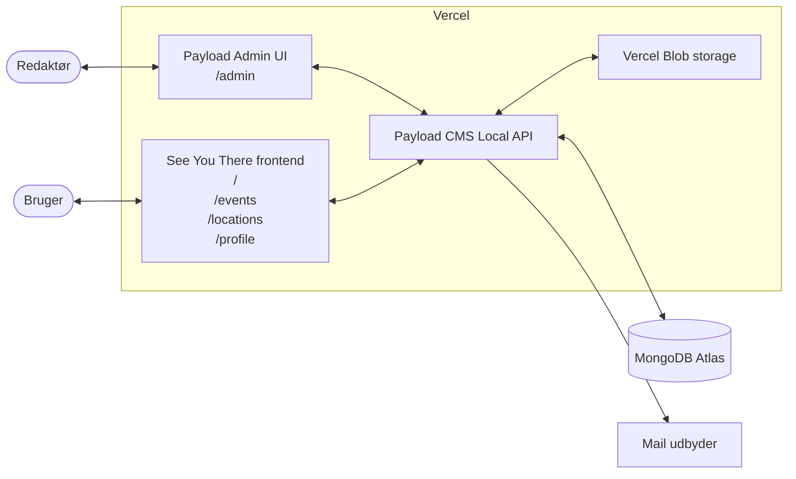
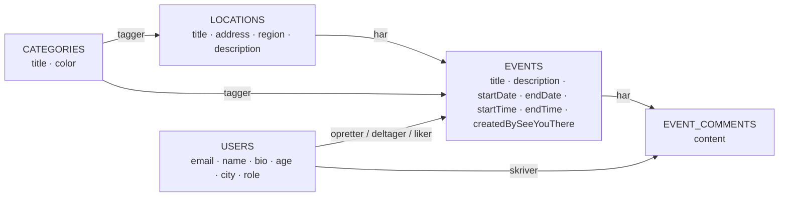

# Arkitektur

## Stack

Dette afsnit beskriver de teknologier, som applikationen er bygget på.

### PayloadCMS

PayloadCMS udgør kernen i projektet. Det er et Node.js-baseret headless CMS (Content Management System), som fungerer særdeles godt sammen med Next.js. En væsentlig fordel ved denne løsning er, at både frontend og backend er skrevet i JavaScript/TypeScript, hvilket skaber et mere ensartet udviklingsmiljø og gør udviklingsprocessen mere overskuelig, da jeg ikke skal arbejde på tværs af forskellige programmeringssprog.

Payload er open source og understøttes af et aktivt community, hvilket gør det til et veletableret og moderne CMS, der passer godt til projektets behov. I 2025 blev Payload desuden opkøbt af Figma, hvilket både viser/indikerer stor interesse for teknologien og giver gode muligheder for en stabil videreudvikling af platformen. Den version af Payload, jeg bruger, er v3, som blev udgivet i november 2024 og fortsat vedligeholdes aktivt.

**Fordele:**

- Frontend og backend anvender samme sprog (TypeScript), hvilket giver en mere sammenhængende udviklingsproces.
- Hurtigt at lære og let at tilpasse til projektets egne datamodeller
- Hosting er enklere, da der ikke kræves en separat PHP-server, som eksempelvis ved WordPress
- Understøtter flere databaser - jeg valgte MongoDB, som Payload anbefaler

**Ulemper:**

- Mindre community end eksempelvis WordPress, hvilket betyder — færre færdige plugins, guides og vejledninger at slå op
- Stadig et ungt projekt, så dokumentation og API'er ændrer sig oftere
- Tæt koblet til Next.js — kan gøre det mere omfattende og svært at skifte frontend-teknologi senere i projektets levetid

### Next.js

En af grundene til, at jeg valgte Payload, er, at systemet som standard er bygget sammen med Next.js, som jeg allerede kender og har erfaring med i forvejen. Next.js er et React-framework, der understøtter både server-side rendering og client-side rendering, hvilket gør det muligt at bygge en moderne og solid frontend-webapplikation. I projektet anvender jeg Next.js 16 (udgivet i oktober 2025) med App Router, som benytter filbaseret routing. Dette gør det nemt at oprette og strukturere nye sider, da routingen automatisk genereres ud fra projektets mappestruktur, sammenlignet med en mere traditionel client-side React-opsætning, hvor routing typisk konfigureres manuelt.

**Fordele:**

- Samme programmeringssprog som backend (TypeScript), hvilket giver en mere ensartet udviklingsproces
- Filbaseret routing via App Router gør projektets sidestruktur overskuelig og forudsigelig
- React Server Components gør det muligt at hente data direkte på serveren uden behov for et ekstra API-lag
- Indbygget optimering af billeder, skrifttyper og bundling bidrager til bedre performance
- Tæt integration med Vercel, som er den anbefalede hostingplatform til Next.js.

**Ulemper:**

- Stærkt bundet til Vercel — hvilket er bedst, hvis man bliver i deres økosystem
- Hyppige opdateringer og nye versioner kan medføre behov for løbende vedligeholdelse og oprydning i koden
- Fejlfinding kan være besværlig og mere kompleks, fordi det ikke altid er tydeligt, om en fejl opstår på server eller i browseren

### MongoDB / Atlas

Denne struktur passer godt til et CMS-drevet projekt, fordi datamodellen ofte udvikler sig undervejs i projektforløbet. Nye felter kan tilføjes, ændres eller fjernes uden behov for at køre tunge og omfattende migrationsprocesser. Samtidig arbejder Payload internt med JSON-lignende datastrukturer, hvilket gør integrationen mellem CMS og database naturlig.

Til hosting af databasen anvendes MongoDB Atlas, som er MongoDBs egen cloud-baserede løsning. Atlas tilbyder blandt andet automatiseret drift, sikkerhedsfunktioner og et gratis cluster, som er tilstrækkeligt til en prototype af denne størrelse.

**Fordele:**

- Fleksibelt skema, som gør det muligt at ændre datamodellen uden omfattende migrationsprocesser
- Velegnet til JSON-lignende data, som Payload allerede arbejder med i forvejen
- Gratis cluster i MongoDB Atlas er rigeligt til udvikling og prototyping
- Tæt integration med Payload og den øvrige teknologistak.

**Ulemper:**

- Færre garantier og indbyggede muligheder for komplekse relationer, sammenlignet med SQL-databaser - fx: på tværs af tabeller
- Komplekse og avancerede forespørgsler på tværs af store datamængder kan blive klodsede og være mere komplekse at implementere
- Et skift til en anden database-type senere, kan kræve ændringer og omskrivning i datalaget og applikationslogikken

## Authentication

Til brugeroprettelse og login anvender jeg Payloads indbyggede `users`-collection, som håndterer hashing af passwords, sessions og rollebaseret adgangskontrol. Ved at benytte den indbyggede løsning får jeg adgang til velafprøvede sikkerhedsfunktioner uden selv at skulle implementere dem fra bunden.

Valget er bevidst, da autentificering er et sikkerhedskritisk område, hvor fejl i implementeringen kan få alvorlige konsekvenser. Derfor vurderer jeg det som en fordel at benytte et veletableret frameworks standardløsninger frem for at udvikle en egen løsning.

### Clerk som muligt alternativ

Jeg har ikke selv arbejdet med Clerk endnu, men har set flere udviklere omtale det positivt — særligt for de færdige UI-komponenter, sociale logins og den indbyggede håndtering af sessions. På POC-stadiet vurderer jeg dog at Payloads indbyggede auth er tilstrækkeligt, og at det ikke giver mening at trække en ekstern auth-tjeneste ind, før jeg ved mere om, hvilke krav projektet reelt får.

## Drift og platform

Hvor den tekniske stack beskriver, hvilke teknologier applikationen er bygget med, handler dette afsnit om, hvor applikationen kører, samt de eksterne tjenester og den infrastruktur, der understøtter løsningen.

### Domain & DNS

Jeg har købt domainet [see-you-there.dk](http://see-you-there.dk) via [simply.com](http://simply.com). Her har jeg via deres DNS (domain name system) mulighed for at pege på den server med projektet der er hosted hos Vercel og sende emails via Resend.

### Hosting

Applikationen hostes på Vercel, som er den anbefalede hostingplatform til Next.js. Platformen tilbyder blandt andet automatiske preview-deployments for hver pull request, et indbygget globalt CDN, samt et gratis hobby-tier, der er tilstrækkeligt til en prototype af denne størrelse.

Jeg har også overvejet at hoste projektet selv ved hjælp af Coolify på en egen server. Denne løsning ville give større kontrol over driften og potentielt lavere omkostninger på længere sigt, hvis projektet vokser ud over Vercels gratis tier.

På nuværende tidspunkt og stadie, vurderer jeg dog at det er unødvendigt, da fordelene ikke opvejer den ekstra kompleksitet, som kræver indsigt i egen server-opsætning. Selv-hosting ville blandt andet medføre ansvar for drift, sikkerhed, backups, håndtering af SSL-certifikater og m.m. hvilket ligger uden for projektets nuværende scope og ressourcer.

Hvis projektet på et senere tidspunkt får flere brugere og højere driftsomkostninger, og Vercel dermed bliver en reel begrænsning, kan en selv-hostet løsning være relevant at genoverveje og vende tilbage til.

### Storage

Da Vercels server ikke har et persistent filsystem, kan uploads ikke gemmes lokalt. I stedet har jeg valgt at bruge Vercel Blob sammen med Payloads `@payloadcms/storage-vercel-blob-adapter`. Dette giver en fuldt managed object storage-løsning, som er tæt integreret med den øvrige hosting-opsætning og leveres direkte via Vercels CDN.

**Fordel:** En væsentlig fordel ved dette valg er den hurtige implementeringstid. Adapteren sættes op med få linjer i `payload.config.ts`, og fordi jeg allerede benytter Vercel til hosting, ligger filerne tæt på Next.js-applikationen. Det sparer mig for at skulle administrere ekstra konti eller konfigurere IAM (Identity and Access Management).

**Ulempe:** Den primære ulempe er dog, at man på Vercels _hobby-tier_ kun får 1 GB gratis Blob-storage. Det er tilstrækkeligt til en Proof of Concept (POC), men det vil hurtigt medføre ekstra omkostninger, hvis platformen vokser og brugerne begynder at uploade billeder til deres begivenheder i større omfang. Bliver det aktuelt, vil det naturlige skifte være at flytte hele driften over på Coolify på egen server (som beskrevet under hosting). Dette vil gøre det muligt at hoste min egen object storage og derved samle driften ét sted, frem for at sprede afhængigheder og omkostninger ud over flere forskellige managed services.

### Storybook-hosting

Designsystemets Storybook-bibliotek hostes gratis på GitHub Pages via et GitHub Actions-workflow, der bygger og udgiver det statiske output automatisk, hver gang der pushes til main. Det betyder, at biblioteket er offentligt tilgængeligt online og nemt kan deles via et link, uden at modtageren behøver at klone og køre projektet lokalt. Den tekniske opsætning er beskrevet i [04_kodeeksempler.md](./04_kodeeksempler.md#3-storybook-som-komponent-bibliotek-og-fremtidig-chromatic).

### E-mail-håndtering

Lige nu bruger vi kun e-mails i forbindelse med oprettelse af brugere eller ved glemt password. Jeg prøvede først at oprette en almindelig Gmail-konto og sende mails via Nodemailer, men Google blokerede hurtigt denne løsning.

Derfor valgte jeg at gå med Resend [https://resend.com/](https://resend.com/), som også anbefales i Payload-dokumentationen.

Det er en fin løsning for nu, men da Resend har sendekvoter, kan det være relevant at overveje at uddelegere til en auth-platform (Clerk). Da mailbehovet udelukkende dækker brugeroprettelse og password-reset, kan det give bedre mening at lade en samlet løsning som Clerk håndtere hele flowet.

## Diagram over teknisk arkitektur

Frontend-delen og Payload CMS afvikles i den samme Next.js-applikation på Vercel, hvilket betyder, at hele systemet deployes som én samlet enhed fra ét fælles repository og med ét sæt miljøvariabler. Payload genererer automatisk TypeScript-typer ud fra mine collections, som frontend-koden kan importere direkte. Hvis jeg eksempelvis omdøber et felt i min `events`-collection, fanges dette med det samme af TypeScript-compileren de steder i frontenden, der refererer til det gamle navn. Applikationens data persisteres i MongoDB Atlas.

Systemet har to primære brugerflader: den offentlige frontend, som almindelige brugere møder i browseren, og Payloads Admin UI på `/admin`, hvor redaktører opretter og redigerer indhold. Begge interfaces er en del af samme Next.js-applikation, men de fungerer som to adskilte lag oven på den samme Payload-instans.

Billed-uploads via administrationspanelet går igennem Payload, som videresender filen til Vercel Blob ved hjælp af `@payloadcms/storage-vercel-blob`. Når et billede efterfølgende skal vises på websitet, returnerer Payload blot URL'en til filen i Vercel Blob – selve dataoverførslen (billed-bytes) går derved udenom Payload-instansen, hvilket aflaster applikationen.

## Datamodel: Relationer mellem events og lokationer

Kernen i datamodellen er struktureret omkring, at et `Event` altid er tilknyttet ét `Location` (hvor relationen er påkrævet/required), mens et `Location` omvendt eksponerer sine tilknyttede events via et `join`-felt. Både `Locations` og `Events` kategoriseres gennem en mange-til-mange-relation til `Categories`. Derudover indeholder hvert lokationsdokument et struktureret adressefelt (bestående af gade, postnummer, by og område – i diagrammet repræsenteret samlet som `address`), hvilket muliggør geografisk filtrering af platformens indhold.

`Users`-collectionen indgår i flere forskellige roller i forhold til en begivenhed: som opretter (én pr. event), som deltager og i form af "likes". For at bevare diagrammets overskuelighed er disse tre relationer slået sammen til én enkelt pil, men i kildekoden er de implementeret som tre selvstændige relationsfelter på `events`-collectionen. Kommentartråde håndteres desuden i en separat `EventComments`-collection frem for direkte i event-dokumentet.
Dette arkitektoniske valg sikrer, at mængden af kommentarer kan vokse frit, uden at det øger det enkelte events dokumentstørrelse unødigt.

For at holde fokus skarpt på det primære event-domæne udelader diagrammet `Media`-collectionen (der håndterer billed-uploads for både `Locations`, `Events` og `Users`) samt Payloads standardiserede CMS-collections (såsom `Posts`, `Pages` og globale felter til header/footer).

## Designsystemets principper og arkitektur

Frontendens designsystem bygger på en række udvalgte principper og værktøjer, der trækker i samme retning og understøtter en konsistent udviklingsproces:

**Figma som moodboard og udgangspunkt – ikke som _Single Source of Truth_:**
Jeg brugte Figma til at samle visuelle stemninger og prøve kort-kompositioner af. Figma-filen er dog bevidst ikke blevet vedligeholdt som projektets autoritative designkilde, da den uundgåeligt ville ende med at komme ud af synkronisering med kildekoden – og det er i sidste ende koden, som brugerne reelt møder og interagerer med.

**Storybook som systemets sandhedskilde:**
Det er i Storybook, komponenterne lever i deres rene form, dokumenteret med tilhørende varianter, props og brugseksempler. Det er dette bibliotek, der definerer, hvordan specifikke komponenter som `SeeYouThereCard`, `Badge` eller `LikeButton` præcist ser ud og opfører sig. Skulle der opstå uoverensstemmelser mellem Figma og Storybook, er det altid Storybook, der er gældende, da det er her, designet er integreret i den faktiske produktionskode.

**Tailwind v4 med CSS-variabler i en trelags _tokens-pipeline_:**

1. _Lag 1 (Rå værdier):_ Globale farveværdier defineres i `:root` ved hjælp af `oklch` – et moderne, perceptuelt ensartet farverum, som gør det lettere at bevare en konsistent kontrast og lysstyrke på tværs af paletten.
2. _Lag 2 (Tema-overstyring):_ En `[data-theme='dark']`-blok overskriver de samme variabler med deres respektive mørke-mode-værdier. Et globalt temaskift kræver derved blot en ændring af en enkelt attribut på `<html>`-elementet.
3. _Lag 3 (Utility-mapping):_ En `@theme`-inline-blok mapper de rå værdier (f.eks. `--background` til `--color-background`), så Tailwind-klasser som `bg-background` og `text-foreground` automatisk peger på de korrekte variabler.

Dette sikrer én kanonisk farvedefinition i hele projektet, hvor eventuelle farveskift kun skal håndteres ét centralt sted.

**Kompositionelle mønstre via _shadcn_-inspirerede komponenter:**
I stedet for store komponenter med mange komplekse props, eksponeres mindre byggeklodser (såsom `Card`, `CardHeader`, `CardBody` og `CardFooter`). Disse kan sammensættes fleksibelt på det enkelte anvendelsessted. Disse _primitives_ forbruger nøjagtigt de samme CSS-variabler som beskrevet ovenfor (`bg-background`, `border-border` osv.). Når en `Badge` eller et `Card` tilføjes til en _story_ eller på en app-side, tilpasser de sig automatisk projektets overordnede farvepalette. Dette understøtter det visuelle designsprog, som i sig selv er kompositionelt; det samme grundlæggende kort-skelet genbruges til både events og lokationer, mens indholdet i de enkelte komponent-slots varierer.

Valget om at ophøje Storybook frem for Figma til den autoritative kilde er en bevidst arkitektonisk beslutning om at lade kode og dokumentation ligge så tæt op ad hinanden som muligt. Storybook-bibliotekets tekniske opsætning uddybes yderligere i filen [04_kodeeksempler.md](./04_kodeeksempler.md#3-storybook-som-komponent-bibliotek-og-fremtidig-chromatic).

## Hvad valgte jeg fra

### Teknologiske fravalg

**WordPress:** Selvom vi blev introduceret til WordPress i skolen, virkede det ikke som den rigtige løsning her. En stor del af konfigurationen i WordPress – herunder temaer, plugins og _custom fields_ – lagres direkte i databasen via administrationspanelet og er dermed ikke synlig i kildekoden eller i Git-historikken. Payload er derimod en _developer-first_-platform, hvor collections, hooks og adgangsregler defineres direkte i TypeScript-filer, som versionsstyres i repositoryet. Det gør projektet langt lettere at overskue, foretage _code reviews_ på og rulle tilbage hvis noget går galt, da alle ændringer ligger som commits.

**Andre headless CMS'er (Sanity og Strapi):** Sanity tilbyder et stærkt redaktørmiljø, men frontend og backend er fuldstændig adskilt på en måde, der ville have krævet mere opsætning. Strapi minder i arkitektur meget om Payload, men jeg fandt Payloads udvikleroplevelse (_developer experience_) og dybe TypeScript-integration mere overbevisende til dette specifikke setup.

**Custom backend (Express) og separat React-frontend:**
Denne tilgang ville have givet maksimal arkitektonisk fleksibilitet, men ville også medføre en markant mængde _boilerplate_-kode til basale funktioner (såsom autentificering, administrationspanel og datavalidering). For et projekt af denne størrelse, er det ikke en hensigtsmæssig prioritering af udviklingstiden.

**Native app eller React Native:** Dette blev fravalgt for udelukkende at kunne fokusere ressourcerne på én samlet kodebase. Skulle behovet for en mobil applikation opstå på sigt, vil en PWA (Progressive Web App) kunne dække mange af de samme behov, uden at jeg skal vedligeholde to separate platforme.

## Hvad skulle måske have været anderledes

### Arkitektoniske overvejelser og potentielle ændringer

**PostgreSQL i stedet for MongoDB:**
Da datamodellen indeholder flere komplekse, tværgående relationer (eksempelvis mellem `events`, `locations`, `users` og `comments`), kunne en relationel database have gjort visse forespørgsler enklere. Payload har dog indbygget understøttelse af PostgreSQL, så hvis data-kompleksiteten stiger, er det muligt at skifte senere.

**PWA fra starten:** Offline-funktionalitet og mobilegenskaber kunne med fordel have været tænkt ind tidligere i processen. Det ville have gjort det muligt at opbygge _service workers_ og caching-strategier som en integreret del af den fundamentale systemarkitektur, frem for som en efterfølgende tilføjelse.
